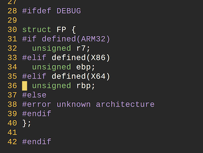
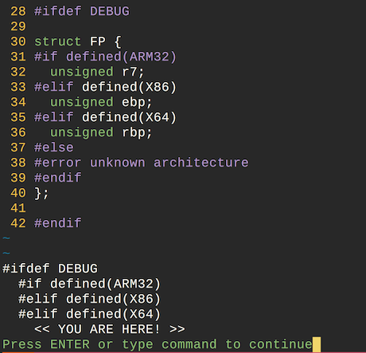

# ifdef-heaven.vim

A Vim plugin that shows where you are in `#if{def|ndef}`(preprocessor directives) blocks.



Press the mapped key! (I use `f` for this)



:D

## How to Install

Copy `ifdef-heaven.vim` to plugin directory.

```
$ cp ifdef-heaven.vim ~/.vim/plugin
```

Append below to `.vimrc` (binding `f` key for this plugin)

```
map f :call IfdefHeaven_WhereAmI() <CR>
```

## How to Use

Press mapped key(`f` for above example).
It will show you the `#if***` context of current cursor position.

